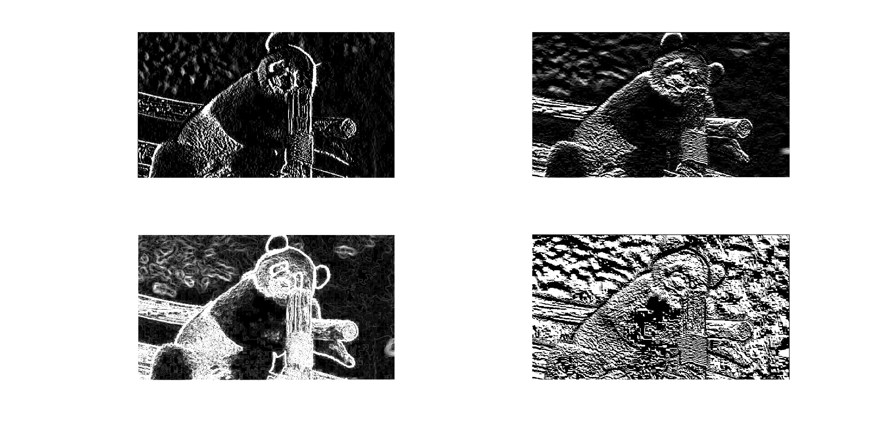
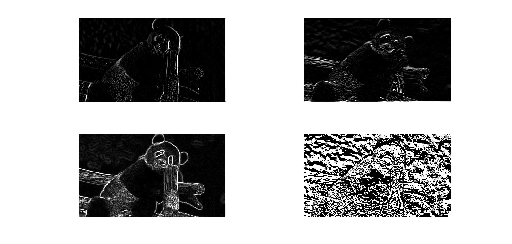
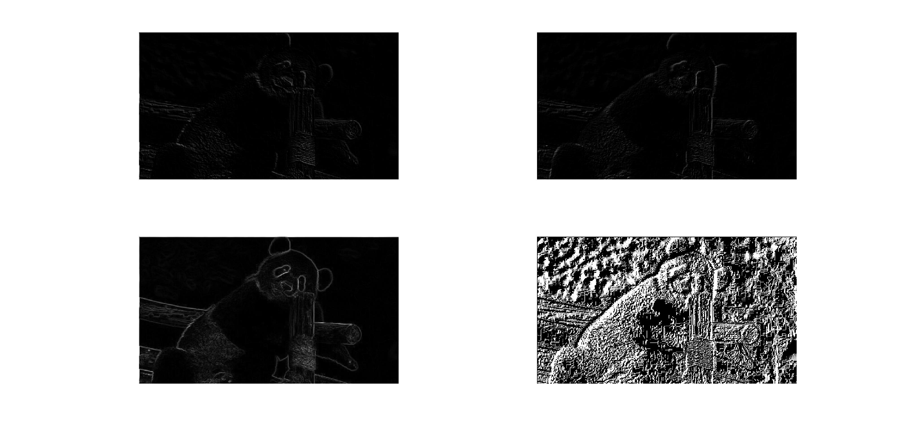

# HOG
implementation of HOG (Histogram of Oriented Gradients) in MATLAB proposed by Dalal and Triggs
Algorithm:
1: Convert the gray-scale image to double format.
2: Get differential images using GetDifferentialFilter and FilterImage
3: Compute the gradients using GetGradient
4: Build the histogram of oriented gradients for all cells using BuildHistogram
5: Build the descriptor of all blocks with normalization using GetBlockDescriptor
6: Return a long vector (hog) by concatenating all block descriptors.

Results of using different filters

